# 👕 MERN Fashion E-Commerce Platform

A full-stack fashion e-commerce platform built as part of the **ShopMyUniform Internship Final Technical Assessment**.

The application enables users to browse products, search and filter items, manage a wishlist and shopping cart, place orders, and track their order status. It also includes a dedicated admin panel for managing products, categories, inventory, and customer orders.

The project is built using the **MERN Stack** with JWT Authentication, MongoDB Atlas, Cloudinary image storage, Razorpay integration, and a fully responsive user interface.

---

# 🔗 Live Demo

### Customer Website

https://project-frontend-sigma-ebon.vercel.app/

### Admin Panel

https://project-admin-dun.vercel.app/orders

### Backend API

https://project-bacend.vercel.app/

### GitHub Repository

https://github.com/Adiejais2006/PROJECT

---

# 📸 Application Screenshots

## 🏠 Home

### Hero Section

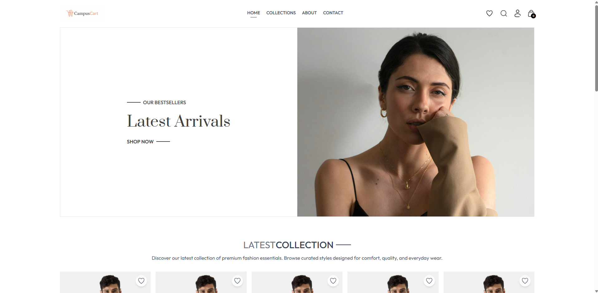

### Latest Collection

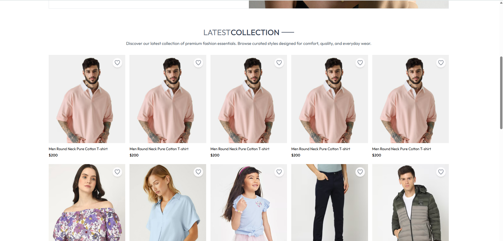

### Best Sellers

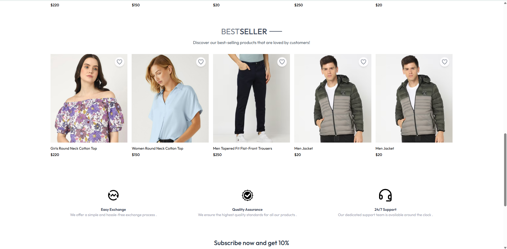

### Newsletter

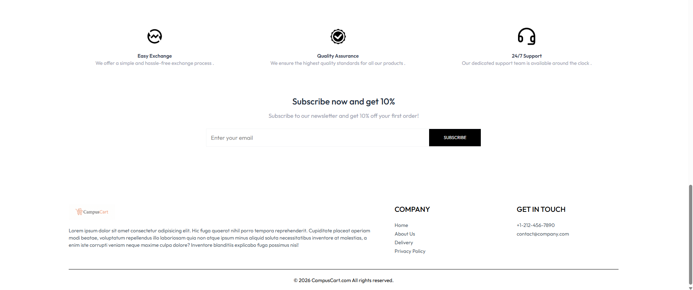

---

## 🛍️ Collections

### Collections Page

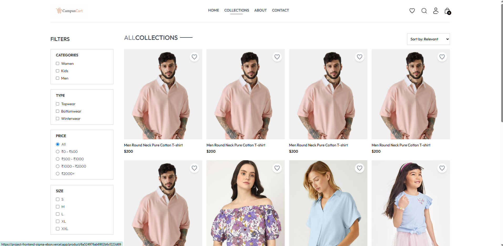

### Filters & Search

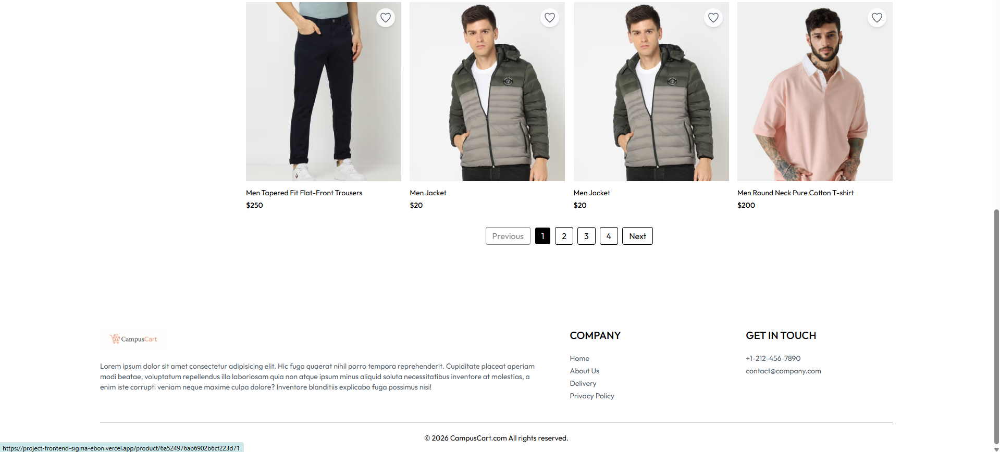

---

## 🛒 Shopping Cart

### Shopping Cart

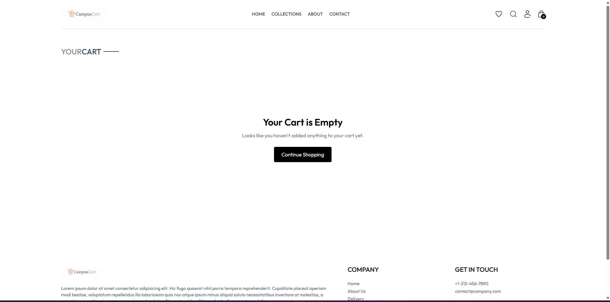

### Cart Summary

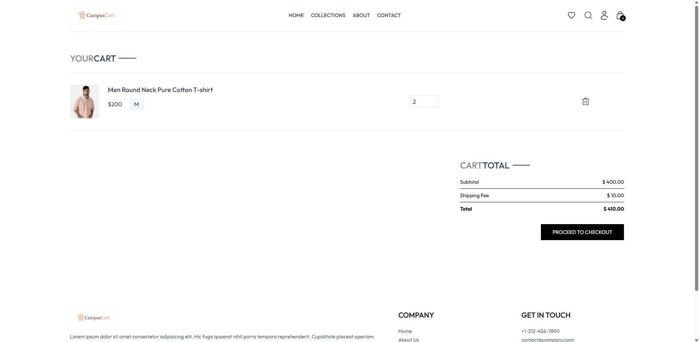

---

## ❤️ Wishlist

### Wishlist

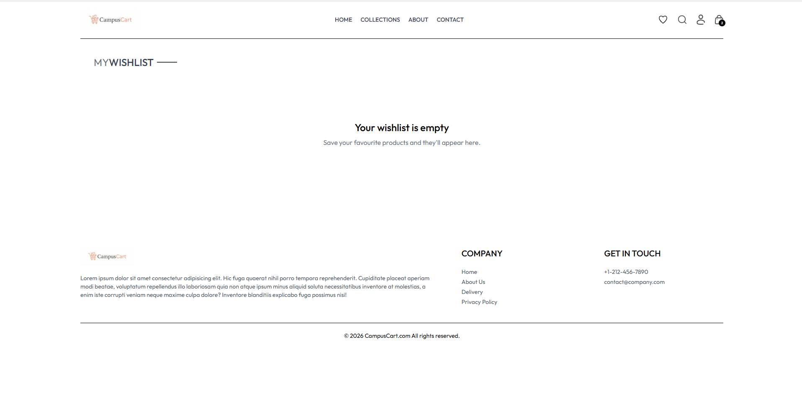

### Wishlist Items

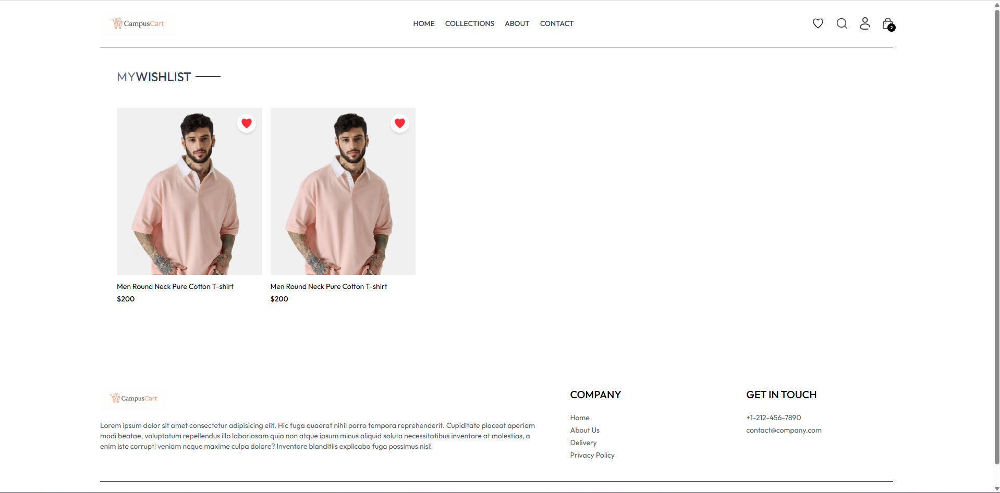

---

## 📦 Orders

### Order History

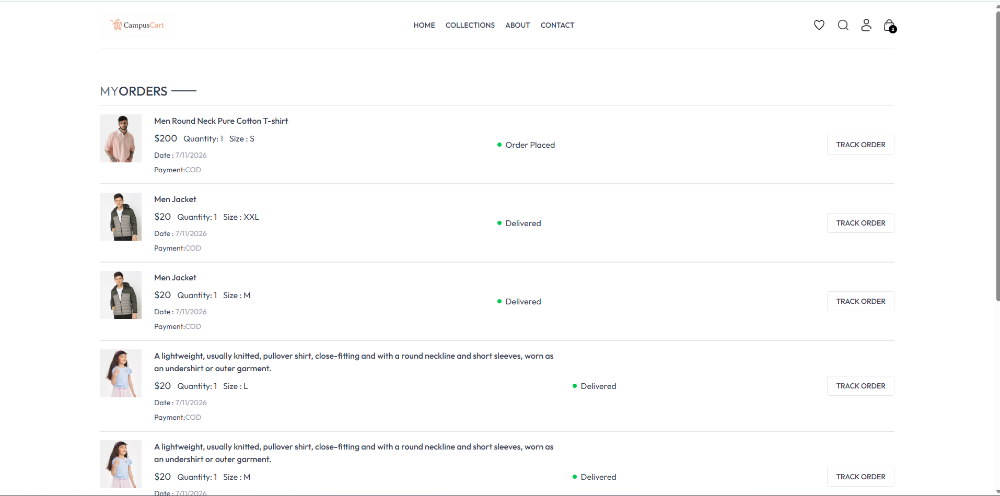

---

## 🛠️ Admin Panel

### Product Management

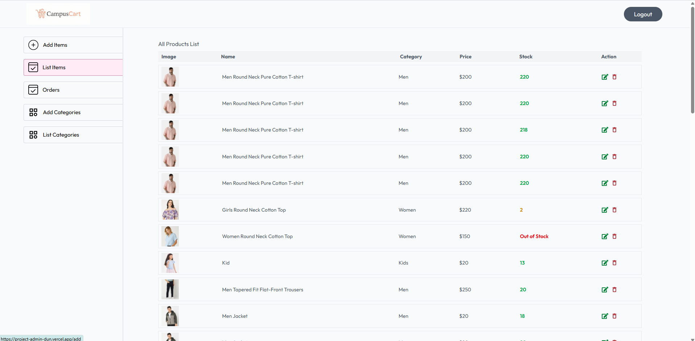

### Add Product

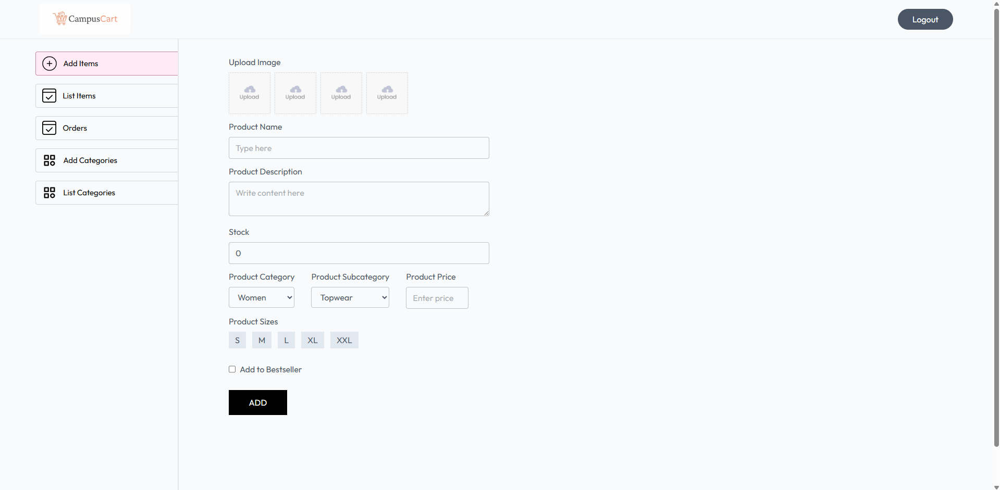

### Category Management


### Add Category


### Order Management

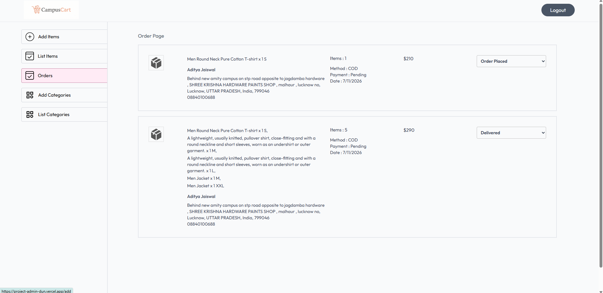

---

## ℹ️ About Page

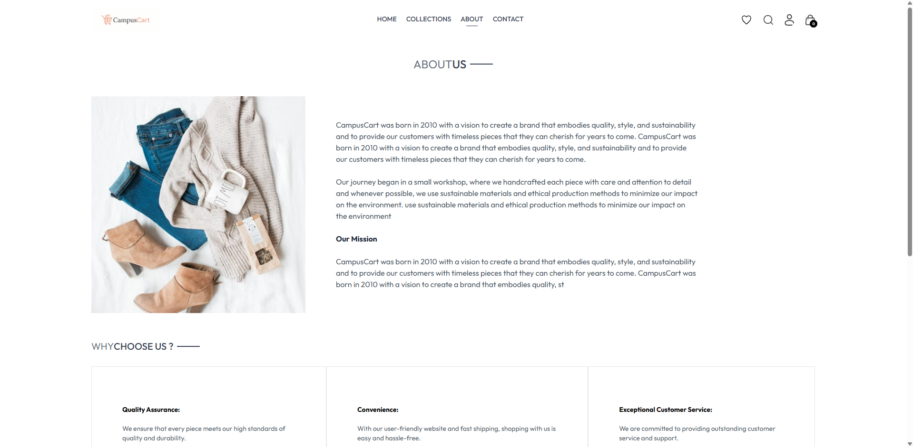

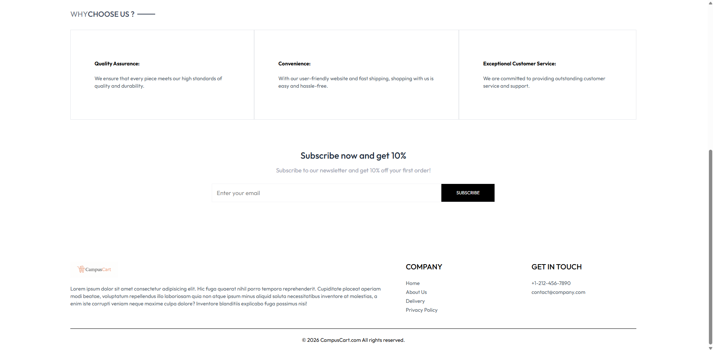

---

## 📞 Contact Page

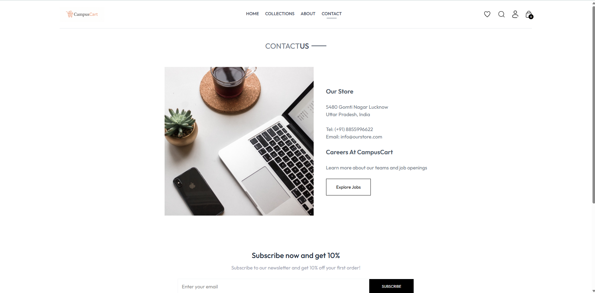

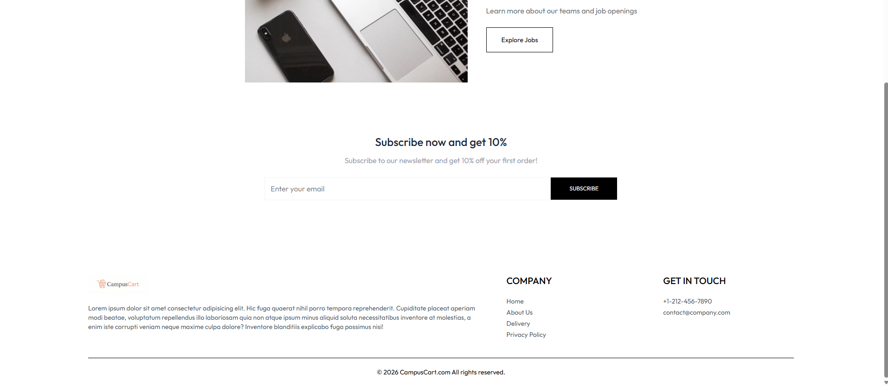

---

# 🔑 Demo Credentials

## Customer

Email

```text
adii@gmail.com
```

Password

```text
Lucknow$1
```

---

## Admin

Email

```text
adityajaiswal94155@gmail.com
```

Password

```text
Lucknow$1
```

---

# ✨ Features

## 👤 User Features

- User Registration & Login (JWT Authentication)
- Persistent Login Sessions
- Browse Products
- Product Details Page
- Search Products
- Filter by
  - Category
  - Subcategory
  - Price
  - Size
- Product Sorting
- Pagination
- Wishlist
- Shopping Cart
- Cash on Delivery (COD)
- Razorpay Payment Integration
- Order History
- Live Order Status Tracking
- Fully Responsive UI

---

## 🛠️ Admin Features

- Admin Authentication
- Add Product
- Edit Product
- Delete Product
- Add Category
- Edit Category
- Delete Category
- Inventory Management
- Stock Management
- View All Orders
- Update Order Status

---

## 📦 Inventory Features

- Product Stock stored in MongoDB
- Automatic Stock Deduction after successful order
- Backend Stock Validation
- Frontend Stock Validation
- Out of Stock UI
- Low Stock Indicator

---

# 🛠️ Tech Stack

## Frontend

- React.js
- Vite
- React Router DOM
- Tailwind CSS
- Axios
- React Toastify

## Backend

- Node.js
- Express.js
- MongoDB Atlas
- Mongoose
- JWT Authentication
- bcrypt
- Multer
- Cloudinary
- Razorpay
- Validator

---

## Why MERN?

The MERN stack was chosen because it provides a complete JavaScript-based full-stack development experience. MongoDB offers flexible document-based storage, Express.js and Node.js provide a scalable backend API, while React with Vite delivers a fast and responsive frontend. Using JavaScript across the entire stack simplifies development and improves maintainability.

---

# 📂 Project Structure

```text
PROJECT
│
├── admin
│   ├── src
│   ├── public
│   └── package.json
│
├── backend
│   ├── config
│   ├── controllers
│   ├── middleware
│   ├── models
│   ├── routes
│   ├── seed
│   ├── package.json
│   └── server.js
│
├── frontend
│   ├── src
│   ├── public
│   └── package.json
│
└── README.md
```

---

# 🚀 Getting Started

## 1. Clone the Repository

```bash
git clone https://github.com/Adiejais2006/PROJECT.git

cd PROJECT
```

---

## 2. Install Dependencies

### Backend

```bash
cd backend
npm install
```

### Frontend

```bash
cd ../frontend
npm install
```

### Admin

```bash
cd admin
npm install
```

## 3. Configure Environment Variables

Create a `.env` file in each project where required using the provided `.env.example` files.

### Backend

```env
MONGODB_URI=

JWT_SECRET=

ADMIN_EMAIL=

ADMIN_PASSWORD=

CLOUDINARY_NAME=

CLOUDINARY_API_KEY=

CLOUDINARY_SECRET_KEY=

STRIPE_SECRET_KEY=

RAZORPAY_KEY_ID=

RAZORPAY_SECRET_KEY=
```

### Frontend

```env
VITE_BACKEND_URL=

VITE_KEY_ID=
```

### Admin

```env
VITE_BACKEND_URL=
```

---

## 4. Seed the Database

The project contains a seed script with demo products and categories.

Run:

```bash
cd backend

npm run seed
```

This populates MongoDB with:

- 38 demo products
- 3 product categories

allowing the application to be tested immediately after setup.

---

## 5. Run the Application

### Backend

```bash
cd backend

npm run server
```

### Frontend

```bash
cd frontend

npm run dev
```

### Admin

```bash
cd admin
npm run dev
```

---

# 🤖 AI Usage

AI tools (primarily ChatGPT) were used as a development assistant for debugging, documentation, implementation guidance, code reviews, and improving development productivity.
All application architecture, feature integration, debugging, testing, and final implementation are fully understood by me. I am able to explain the complete codebase, design decisions, and implementation details during a live technical walkthrough.

---

# ⚠️ Known Limitations

- Product reviews and ratings are not implemented.
- Coupon and discount system is not implemented.
- Automated unit/integration tests are not included.
- Docker support is not included.
- Additional production hardening (rate limiting and security headers) can be added.

---

# 🚀 Future Improvements

- Product Reviews & Ratings
- Coupon & Discount System
- Email Notifications
- Automated Testing
- Docker Support
- Security Hardening
- Analytics Dashboard
- Product Recommendation System
- Recently Viewed Products

---

# 📄 License

This project was developed as part of the **ShopMyUniform Internship Final Technical Assessment**.

It is intended solely for evaluation purposes.
